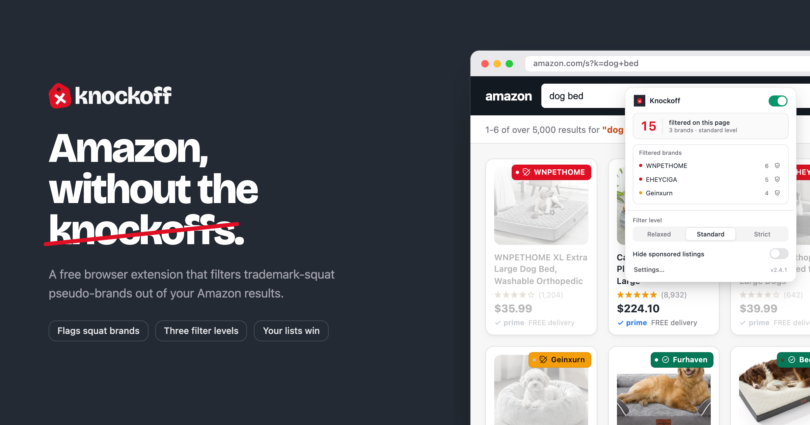

# Knockoff

**A browser extension that filters pseudo-brand junk out of Amazon.** Buy from
real, established brands, even when that means paying more.

Amazon is flooded with trademark-squat "brands" (SZHLUX, HORUSDY, LATTOOK,
DOZAWA...): random strings registered at the USPTO purely to unlock Amazon
Brand Registry, selling commodity goods with no company, no warranty, and no
reputation behind them. Knockoff detects those listings and hides, dims, or
labels them, right in the search results.

> [!NOTE]
> **This is a frozen public snapshot.** Active development has moved to a
> private repository, and future versions are no longer built in the open — so
> nothing here phones home. Loaded as-is, this build makes **zero calls to any
> Knockoff server**: it runs entirely on the brand lists bundled in the repo,
> and it won't receive further updates. For the maintained, auto-updating
> extension, install from the stores below. To run the fully local build
> yourself, see [Self-contained by default](#self-contained-by-default).

## Install

**[Add to Chrome](https://chromewebstore.google.com/detail/pjgickchbiikhdfpmecaabkphmofpdce)** from the Chrome Web Store, or
**[Add to Firefox](https://addons.mozilla.org/en-US/firefox/addon/knockoff-amazon-brand-filter/)** from Firefox Add-ons.

Or run the fully local build straight from this repo:

1. Clone this repo
2. Open `chrome://extensions`
3. Turn on **Developer mode** (top right)
4. Click **Load unpacked** and select the repo folder

Works on every Amazon marketplace, with no server behind it.

### Safari

Safari requires the extension to be wrapped in a native app. Open
[`safari/Knockoff/Knockoff.xcodeproj`](safari/Knockoff) in Xcode, run the
**Knockoff** scheme, then enable Knockoff in Safari → Settings →
Extensions. For unsigned local builds, first check "Allow unsigned
extensions" in Safari's Develop menu.

The Xcode project carries its own copy of the extension files; after
editing the extension, run [`scripts/sync-safari.sh`](scripts/sync-safari.sh)
to update it before rebuilding.

## Press

Some of the coverage since launch:

- [Fast Company](https://www.fastcompany.com/91570721/amazon-shopping-slop-viral-new-tool-filters-out-knockoff-brands)
- [Gizmodo](https://gizmodo.com/new-browser-extension-helps-you-dodge-amazons-sea-of-knock-off-products-2000783054)
- [404 Media](https://www.404media.co/knockoff-browser-extension-hides-sketchy-brands-on-amazon/)
- [PC Gamer](https://www.pcgamer.com/hardware/this-chrome-extension-hides-knockoff-brands-on-amazon-sorry-to-brands-like-wnpethome-eheyciga-yxy/)
- [Yahoo](https://tech.yahoo.com/apps/articles/chrome-extension-removes-unknown-brands-162002361.html)
- [Lifehacker](https://lifehacker.com/tech/knockoff-browser-extension-hides-shady-items-on-amazon)

## How it works

Everything runs locally in a content script. No accounts, no tracking, no
network requests of any kind. Each product tile's brand is
resolved through this pipeline (first match wins):

| # | Check | Verdict |
|---|-------|---------|
| 1 | Your allowlist | `allowed`, never filtered |
| 2 | Your blocklist | `blocked`, always filtered |
| 3 | Seed list of notorious pseudo-brands ([`data/flagged-brands.js`](data/flagged-brands.js)) | `flagged` |
| 4 | Established Chinese-owned brands ([`data/chinese-major.js`](data/chinese-major.js)) | `known`, or `flagged` if you enable that setting |
| 5 | ~5,000 established brands ([`data/known-brands.js`](data/known-brands.js) + the bundled community allowlist in [`data/community-brands.js`](data/community-brands.js)) | `known` |
| 6 | Name heuristics (see below) | `flagged` / `suspect` / `unknown` |
| - | No brand at the front of the title at all | `unbranded` |

### Name heuristics

Unknown brands are scored on the linguistic signature of trademark-squat
names: ALL-CAPS 5–9 character strings, vanishing vowel ratios,
unpronounceable consonant runs, un-English letter pairs, non-Latin
characters, random iNternal caPitalization. High scores are `flagged`,
mid scores `suspect`. The known-brands list always vetoes the heuristics:
plenty of real brands (ASICS, RYOBI, HOKA) would otherwise look suspicious.
Scoring lives in [`src/detector.js`](src/detector.js) and is deliberately
readable, and easy to tune for your own build.

### Filter levels

| Level | Filters |
|-------|---------|
| **Relaxed** | Known pseudo-brands + your blocklist |
| **Standard** (default) | + suspect-looking names + unbranded listings |
| **Strict** | + anything not on a known-brands list (allowlist-only) |

### Actions

Filtered items can be **hidden** (with a floating pill showing the count and
a one-click reveal), **dimmed** (fade + desaturate, restore on hover), or
just **labeled**. Every badge is clickable: trust the brand, block it, show
the item once, or report a misclassification.

Product detail pages get a verdict chip next to the brand byline. The page
is never hidden out from under you.

## Self-contained by default

This build talks to no server. Every feature that could make a network request
is either satisfied from bundled data or turned off:

- **Brand lists** — the ~5,000 known brands and the community allowlist ship in
  [`data/`](data/). There is no daily refresh; the bundled snapshot is the
  whole list.
- **DOM config** — the selectors the scanner uses live in
  [`data/config.js`](data/config.js). There is no config push; the bundled copy
  is authoritative.
- **Reports** — the one-click "wrong verdict" button opens a prefilled GitHub
  issue instead of POSTing to an API.

The switches for all of this are the three constants at the top of
[`src/content.js`](src/content.js) — `BRANDS_URL`, `CONFIG_URL`, and
`REPORT_ENDPOINT` — which ship blank. Point them at your own host to re-enable
on-demand list refresh, config pushes, and structured reports. (The server
itself is not part of this repo.)

## Reporting misclassifications

The badge menu has one-click reporting ("this is junk" / "this is a real
brand"). Because this snapshot ships with no report endpoint configured, a
report opens a prefilled GitHub issue rather than posting anywhere. Wire up your
own endpoint (see [Self-contained by default](#self-contained-by-default)) to
collect them as structured POSTs instead — brand, verdict, ASIN, marketplace,
and extension version, no PII.

## Editing the brand lists

There is no build step — the extension is plain JavaScript, loadable directly
from the repo — so the lists are easy to tune for your own copy. A real brand
getting filtered goes in [`data/known-brands.js`](data/known-brands.js); a
pseudo-brand getting through goes in
[`data/flagged-brands.js`](data/flagged-brands.js); the full rundown is in
[CONTRIBUTING.md](CONTRIBUTING.md).

Because this repository is a frozen snapshot, pull requests here won't ship to
the published extension — but your edits take effect immediately in a local
build.

```
manifest.json             MV3 manifest
data/known-brands.js      curated established brands (edit this one!)
data/chinese-major.js     established Chinese-owned brands (toggleable)
data/flagged-brands.js    seed blocklist of notorious pseudo-brands
data/generic-words.js     common title words, for unbranded detection
data/community-brands.js  bundled community allowlist snapshot (generated, don't edit)
src/detector.js           detection engine (pure logic, no DOM)
src/content.js            page scanning, badges, actions, in-page control panel
src/background.js         toolbar button → panel toggle (or options page)
options/                  settings page (rules, allow/blocklist)
safari/                   Xcode wrapper app for Safari (macOS)
store-assets/             Chrome Web Store images + the HTML frames that render them
scripts/                  maintenance scripts
```

## Known limitations

- **Mixed-case gibberish** ("Geinxurn", "Mulwark") scores below the suspect
  threshold at standard level; Strict mode catches it. A bundled character
  bigram model would fix this properly.
- Carousels and a few exotic tile layouts aren't scanned yet
  (`TILE_SELECTORS` in `src/content.js` is the extension point).
- Non-English stores are best-effort. Brand lists and the product-page chip work
  everywhere, but the name heuristics are English-tuned, so an unlisted local
  brand can slip through. Non-Latin listings (Japanese, Arabic) are skipped rather
  than mis-filtered, so nothing breaks on any marketplace.

## Prior art

Research that shaped this design: [AmazonBrandFilter](https://github.com/chris-mosley/AmazonBrandFilter)
(allowlist approach; its MIT-licensed community list seeded Knockoff's own)
and The Markup's
[Amazon Brand Detector](https://github.com/the-markup/tool-amazon-brand-detector).
Knockoff's contribution is combining a community allowlist with a
heuristic scorer, with the allowlist as veto.

## License

This snapshot is released under [FSL-1.1-MIT](LICENSE) (each version converts to
MIT two years after its release). Knockoff is no longer developed as an
open-source project: active work happens in a private repository, and future
versions are not published here.
